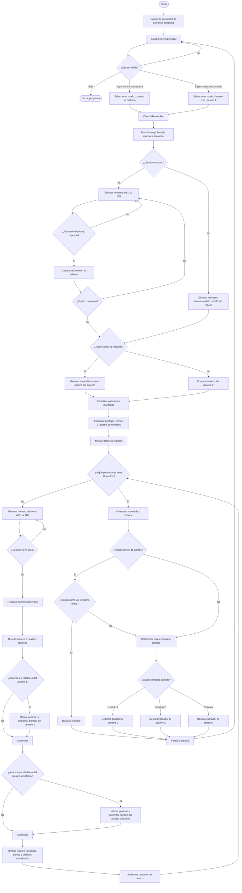

## Realiza un programa en Cpp donde se simule el juego bingo, con las siguientes características:
- El usuario podrá elegir si juega contra la máquina o contra otro usuario.

- Si elige jugar contra la máquina, el usuario podrá elegir los números que contendrá su tablero de juego, siendo este una matriz de 4X4. De igual manera se generará el tablero del sistema, siendo una matriz de 4X4 que se llenará de manera automática con valores random (investigar como se genera un número random y aplicar), todos los valores permitidos serán entre 1 y 100, sin repetir valores.
- Sí elige jugar contra otro usuario, cada uno de los usuarios podrá generar su carta indicando los valores entre 1 y 100 siendo esta de 4X4, sin repetir valores.
- También cada usuario podrá elegir la opción de generar tabla aleatoriamente, sin repetir valores.
- Comenzar juego: se irán generando números aleatorios de uno en uno entre 1 y 100, cada valor será comparado en ambas tablas cuadro por cuadro para verificar si existe, se irá incrementando un contados para el usuario 1 y el usuario 2 (o el sistema en dado caso).
- El juego termina en el momento que uno de los dos jugadores llega a 16 puntos, es decir el tablero completo.
- Al final, debe especificar el usuario ganador.
- El usuario podrá seguir jugando, seleccionando en las opciones del menú, hasta el momento que seleccione salir del programa y todo se cierra.
- El programa se podrá trabajar en parejas, no olviden que solo un integrante es el encargado de subir la actividad y colocar en los comentarios el nombre de los integrantes.

## El diagrama de flujo es el siguiente:

